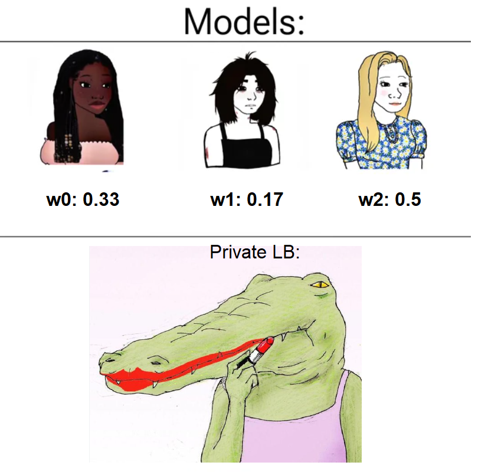
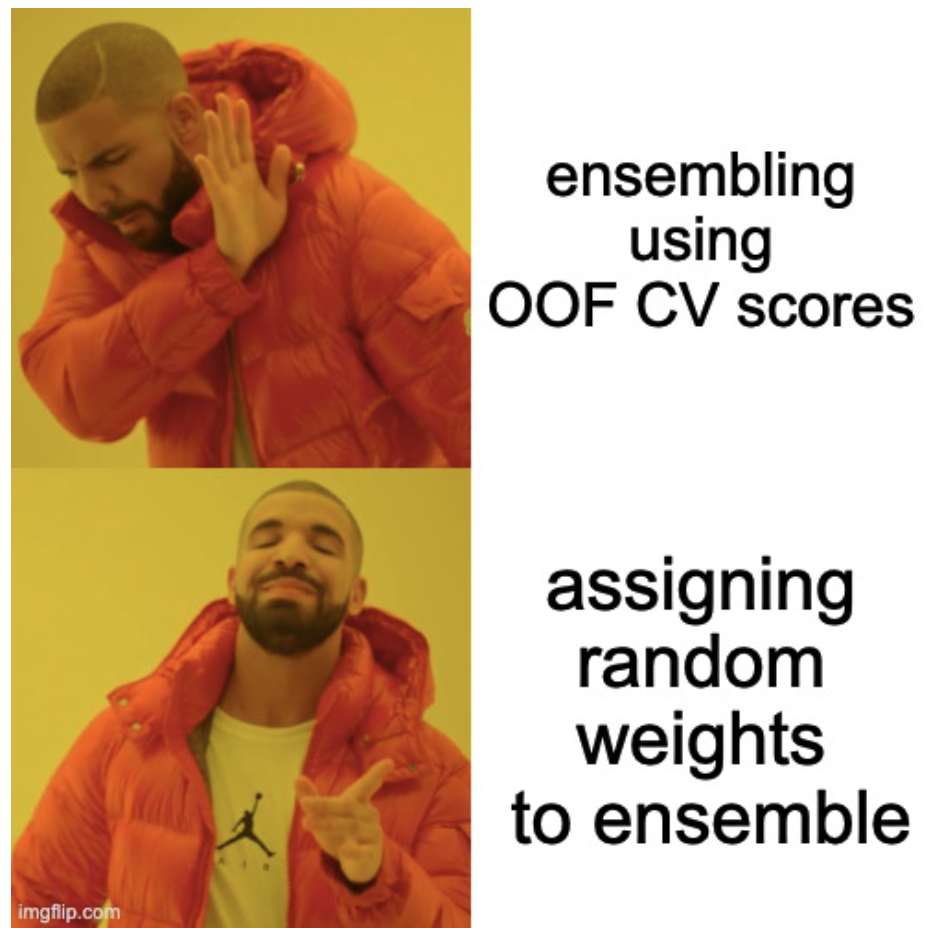

| Name | [Multi-Class Prediction of Obesity Risk](https://www.kaggle.com/competitions/playground-series-s4e2) |  |
| ---- | ------------------------------------------------------------------------------------------------- | - |
| Tags | Time Series Analysis MultClass Classfication                                                      |  |
| Time | 2024/3/1                                                                                          |  |

# Multi-Class Prediction of Obesity Risk

# 1.投票最高的笔记本

# 2.得分最高的笔记本

## 2.1 [4th place solution: Stacking with XGB + Pseudo labeling + metric optimizing.](https://www.kaggle.com/competitions/playground-series-s4e2/discussion/480939)

1. 总结：一种堆叠方法，XGB作为元学习，不同的SOTA解决方案作为每个预测的额外附加堆叠功能。最终推理包括优化的准确性指标和对不同版本堆叠代码的 9 次预测，以及其他针对每行最大类计数的不同解决方案。
2. **数据和特征工程**：

   * 第一种特征工程方法：

   1. 首先从两个不同的 CSV 文件中读取数据，一个是 train 数据，另一个是 original 数据。
   2. 将这两个数据集合并起来，去除 'id' 列，去除重复项，并重新设置索引。
   3. 对训练数据进行特征工程：

      * 创建新特征 'Age_Group'，根据 'Age' 列将年龄分为不同的组别并用标签表示。
      * 创建新特征 'Log_Age'，对 'Age' 列取对数（使用 np.log1p 函数）。
      * 使用 MinMaxScaler 对 'Age' 列进行最小-最大缩放，创建新特征 'Scaled_Age'。
   4. 从另一个 CSV 文件中读取测试数据。
   5. 对测试数据进行类似的特征工程处理：

      * 创建新特征 'Age_Group'，根据 'Age' 列将年龄分为不同的组别并用标签表示。
      * 创建新特征 'Log_Age'，对 'Age' 列取对数（使用 np.log1p 函数）。
      * 使用之前创建的 MinMaxScaler 对 'Age' 列进行缩放，创建新特征 'Scaled_Age'。
   6. 最后，对训练数据集中的目标标签列 'NObeyesdad' 进行编码处理，使用 LabelEncoder 对其进行转换为数值。
   7. 对训练数据集 'train' 进行特征工程：

      * 根据 'Age' 列将年龄分组为不同年龄段并用标签表示。
      * 计算 BMI（Body Mass Index）指数，即体重除以身高的平方。
      * 创建新特征 'Age * Gender'，为 'Age' 列与 'Gender' 列的乘积。
      * 对分类特征进行独热编码处理。
      * 使用 PolynomialFeatures 创建二次多项式特征，并添加到训练数据集中。
   8. 对测试数据集 'test' 进行类似的特征工程处理。
   9. 对原始数据集 'original' 也进行类似的特征工程处理。
3. **用于堆叠方法的模型和框架。**

   竞争指标是准确性，但对于训练log_loss设置了，每个解决方案的概率被保存以备后用。

   *  自动XGB
   * AutoGluon 采用新的零样本 HPO 训练。
     集合权重： {'CatBoost_r9_BAG_L1'： 0.363， 'LightGBM_r131_BAG_L1'： 0.253， 'XGBoost_BAG_L1'： 0.099， 'XGBoost_r33_BAG_L1'： 0.099， 'NeuralNetTorch_BAG_L2'： 0.077， 'ExtraTreesEntr_BAG_L2'： 0.033， 'NeuralNetFastAI_BAG_L2'： 0.022， 'CatBoost_BAG_L2'： 0.022， 'NeuralNetTorch_BAG_L1'： 0.011， 'RandomForestGini_BAG_L2'： 0.011， 'ExtraTreesGini_BAG_L2'： 0.011}
   * 带有 LGBM 和 Catboost 的 LightAutoml。
   * 自定义 XGB + LGBM 训练代码，带和不带伪标签训练。
4. 模型堆叠：使用训练中的特征，并添加来自不同解决方案的概率作为额外特征。元模型是 XGB。与其他技术相比，堆叠是分类问题的一种很好的方法。
5. **指标优化和最终推理：**

   我使用公共代码来优化指标，并为它使用了早期保存的每个类的概率。
   优化的公共代码可以在这里找到 https://www.kaggle.com/code/samlakhmani/easy-92-196-single-model。

   对于最终的推理，我使用了自己训练的解决方案和 2 个公共笔记本的各种 9 个预测集合，并计算了每行的最大类。

# 3.高分方法与讨论
