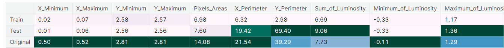
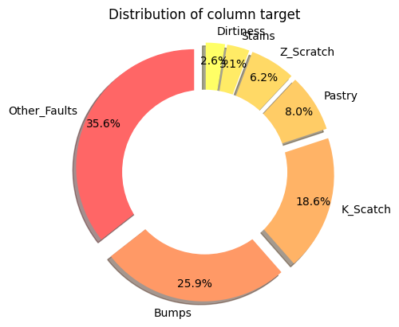
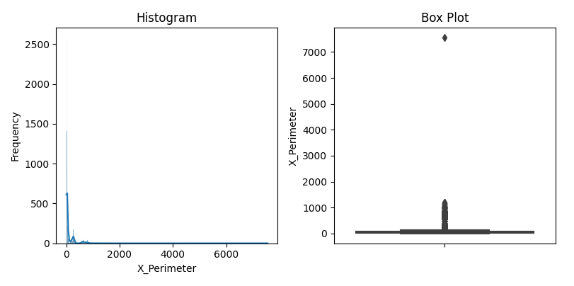
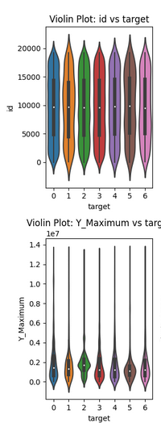
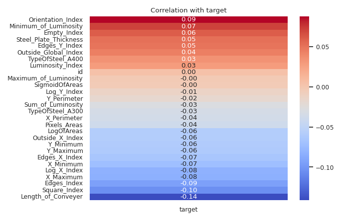
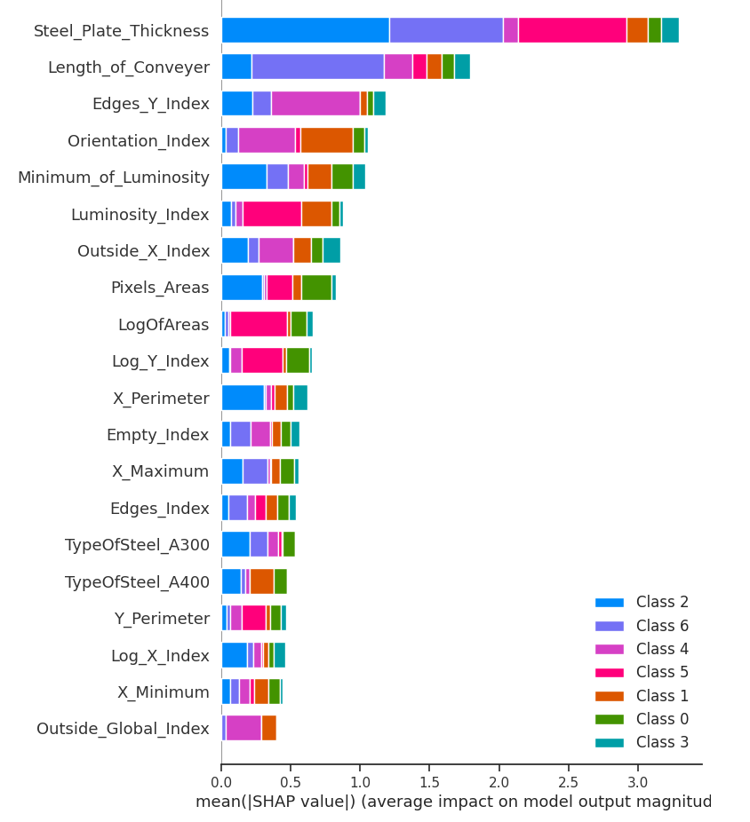
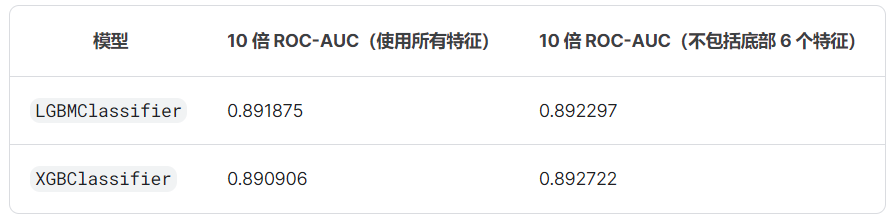

| Name | [Steel Plate Defect Prediction](https://www.kaggle.com/competitions/playground-series-s4e3) |
| ---- | ---------------------------------------------------------------------------------------- |
| Tags |                                                                                          |
| Time |                                                                                          |

# Steel Plate Defect Prediction

## 1EDA

### 1.1[PlaygroundS4E03|EDA|MulticlassClassifier|V1](https://www.kaggle.com/code/humbleyll/playgrounds4e03-eda-multiclassclassifier-v1?scriptVersionId=166807954)

1. 合成数据中的偏度问题：🤩EDA包含查看原始数据的偏度：https://www.kaggle.com/code/ravi20076/playgrounds4e03-eda-multiclassclassifier-v1?scriptVersionId=166119178&cellId=19 ；偏度是概率分布不对称性的度量。它指示数据是否向左倾斜（负偏度）或向右（正偏度），或者是否具有对称分布（零偏度）。在考虑独立特征时，每个特征的偏度可以提供对数据分布和分析可能需要的潜在数据转换的洞察。独立特征之间的偏度可以帮助识别可能需要标准化或转换的变量，以更好地满足统计模型的假设。
2. 集成模型的类：🤩https://www.kaggle.com/code/ravi20076/playgrounds4e03-eda-multiclassclassifier-v1?scriptVersionId=166119178&cellId=25

### 1.2[A first overview of the data and recommendations](https://www.kaggle.com/competitions/playground-series-s4e3/discussion/481098)

1. 本质上，我们有一个多类问题需要解决。通过一个小的辅助函数，我们可以将数据集转换为多类兼容的训练集：它假设 DataFrame 包含了一些特定的目标列（target_cols），以及其他非目标列（non_target_cols）。然后，它遍历每个目标列，根据列中的值将数据拆分为多个二元数据集，并对每个数据集进行处理。最后，它将所有处理后的数据集合并成一个新的 DataFrame 并返回。

   1. 首先，从输入的 DataFrame 中去除目标列，得到非目标列的列表。
   2. 针对每个目标列，创建一个临时的 DataFrame，包括非目标列和当前目标列，而且只保留目标列中取值为 1 的行（即正例）。
   3. 将目标列的值改为该列的类名，并将目标列的名称统一为 "target"，以便后续合并。
   4. 将所有临时的 DataFrame 合并成一个新的 DataFrame，并返回该 DataFrame。
2. 目标列分布：

   
3. 数据分布：一些特征表现出很强的偏度：

   * 基于树的模型的建议：不执行任何操作
   * 线性模型的建议：通过 [yeo-johnson 转换](https://zhuanlan.zhihu.com/p/571665528)数据（也可能进行缩尾化、对数转换）

   
4. **类别比较的特点**：一些功能似乎在类之间几乎没有差异：建议：尝试删除它们，看看 CV 分数如何变化。

   
5. **线性信息：总体而言，这些特征几乎没有线性信息：然而，这可能来自次优标签编码。**

   * 与线性模型相比，更喜欢树模型和神经网络等非线性模型
   * 使用有意义的标签编码而不是这种随机变体

   
6. **非线性信息：我们还可以看到，在互信息得分中，从高价值到可能可丢弃的特征之间存在很大差异：**

   * 探索放弃无价值的功能
   * 探索创建高价值特征之间的比率

   
7. **需要多少个组件？** 假设我们想将特征转换为主成分，我们需要多少个成分来保留与原始数据的所有方差？我们需要超过 10 个特征才能达到 90% 的方差。

   * 不要将 PCA 视为额外功能
   * 不要考虑使用 PCA 来减少特征数量

   
8. **Data drift**：训练数据和测试数据之间似乎没有显着的数据漂移。
9. **特征重要性：您可以在此处查看多个 Xgboost 模型之一的 SHAP 值：**

   
10. **预测class的效果如何？有些类别（尤其是脏度）更难预测：使用神经网络时，尝试自定义损失函数，以对“脏”等类别赋予更多权重。**

    
11. **参数的总体重要性**：以下是迄今为止我的测试中与模型性能最相关的因素：看起来使用的数据点和列样本在这里非常重要。 Xgboost 中的 lambda 和 alpha 等调节参数也很重要。高度重视潜在的过度拟合。这看起来是一个很大的风险。

    
12. **🤩完整的EDA笔记本：https://www.kaggle.com/code/thomasmeiner/ps4e3-eda-feature-engineering-model**

## 2投票最高的笔记本

## 3得分最高的内核

## 4高分方法与讨论

### 4.1[Steel Plate Defect Prediction](https://www.kaggle.com/competitions/playground-series-s4e3/discussion/482401)

1. 将7个独立的二进制分类任务转换为一个单独的多类分类任务：假设数据集中有多个列表示不同的产品缺陷类型（比如 Pastry、Z_Scratch、K_Scatch 等），而我们希望根据这些缺陷类型的情况来对产品进行分类标记。通过嵌套的 `np.where` 函数，可以根据不同的条件依次进行判断，直到找到符合条件的列，然后将相应的缺陷类型赋给 `target` 列。最后一个 `np.where` 函数中的 'Other_Faults' 是作为默认值，表示如果前面的条件都不满足，就将 'Other_Faults' 赋给 `target` 列。
2. 删除部分特征：

   
